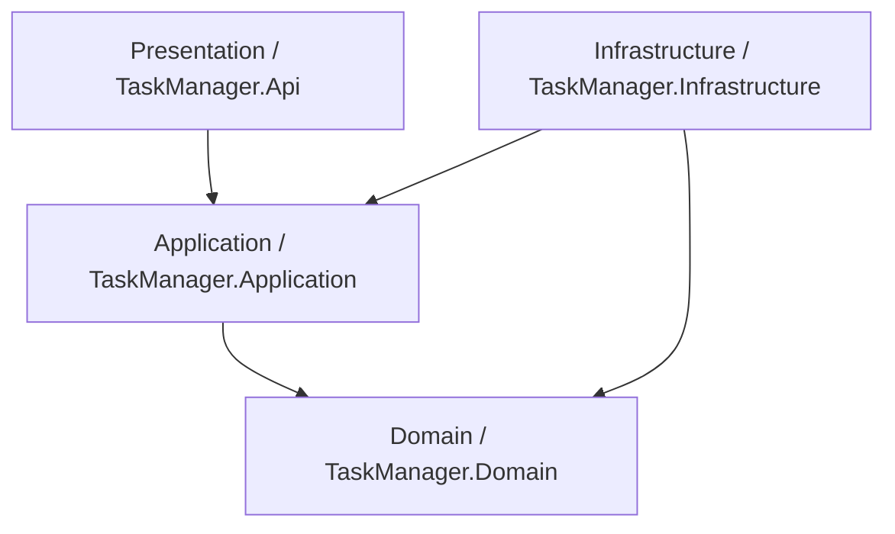

# TaskManager - Project & Task Management API

A production-grade, highly scalable backend system for managing Projects and Tasks, designed using **Clean Architecture** and **Command Query Responsibility Segregation (CQRS)** patterns.

---

## 🏗️ Technical Stack

- **Framework**: .NET 10 (fully compatible with .NET 9)
- **Database**: SQL Server
- **ORM**: Entity Framework Core
- **Authentication**: JWT Bearer Authentication & ASP.NET Core Identity
- **Design Patterns**: CQRS with MediatR, Repository Pattern & Unit of Work, Result Pattern

---

## 📂 Architecture Overview

The system is designed following **Clean Architecture** principles to promote high testability, maintainability, and loose coupling:



### 1. Domain Layer (`TaskManager.Domain`)
- Core domain models: `Project` and `ProjectTask`.
- Identity models: `ApplicationUser` and `ApplicationRole`.
- Business constants and enums: `Status` (Todo, InProgress, Completed), `Priority` (Low, Medium, High).
- Zero external dependencies.

### 2. Application Layer (`TaskManager.Application`)
- Business workflows implemented as **CQRS** Commands and Queries using **MediatR**.
- Request/Response contracts (DTOs) and mappings.
- Validation logic implemented via **FluentValidation** and integrated automatically into the MediatR pipeline using custom pipeline behaviors.

### 3. Infrastructure Layer (`TaskManager.Infrastructure`)
- Database context implementation (`ApplicationDbContext`) using Entity Framework Core.
- **Repository Pattern & Unit of Work**: Abstracted database access layer.
- Authentication & JWT Services: Handles JWT generation, Refresh Token validation, and user roles.
- Caching: MemoryCache and Redis integration.
- Database seeding: Automatically seeds default administrative roles and permissions.

### 4. Presentation Layer (`TaskManager.Api`)
- RESTful API Controllers.
- Swagger UI with built-in JWT authorization support.
- Global Exception Handler: Intercepts exceptions globally and returns structured, standardized responses.

---

## 📋 Implemented Requirements Checklists

### 1. Functional Requirements
- [x] **Authentication**
  - `POST /api/Auth/Register` (Register user)
  - `POST /api/Auth/Login` (Login user and retrieve JWT + Refresh Token)
- [x] **Projects Module** (Ownership-bounded)
  - `POST /api/Projects` (Create project)
  - `GET /api/Projects` (Get all projects created by the authenticated user)
  - `GET /api/Projects/{id}` (Get project by ID)
  - `PUT /api/Projects/{id}` (Update project)
  - `DELETE /api/Projects/{id}` (Delete project)
- [x] **Tasks Module**
  - `POST /api/Tasks` (Create task inside a project)
  - `GET /api/Tasks/project/{projectId}` (Get tasks belonging to a project)
  - `PUT /api/Tasks/{id}/status` (Update task status)
  - `DELETE /api/Tasks/{id}` (Delete task)

### 2. Architectural Requirements
- [x] **Clean Architecture**: Strong boundary isolation.
- [x] **Dependency Injection**: Loose coupling via IoC container registration.
- [x] **SOLID Principles**: Single Responsibility (separated handlers and validators), Open-Closed, Dependency Inversion (repositories abstract database logic).
- [x] **DTO Usage**: Request/Response models are decoupled from database entities. Input models are validated prior to execution.
- [x] **Global Exception Handling**: Centralized `GlobalExceptionHandler` returning RFC-compliant `ProblemDetails`.
- [x] **Validation**: Integrated FluentValidation pipeline.

### 3. Bonus Points Implemented
- [x] **CQRS (Command Query Responsibility Segregation)**: Read and Write pipelines are separated.
- [x] **MediatR**: Decouples Controllers from Business Logic Handlers.
- [x] **Generic Response Wrapper**: Monadic `Result` and `Result<T>` pattern for consistent, type-safe operation outcomes.
- [x] **Role-based Authorization**: Restricts endpoints by custom application permissions.
- [x] **Redis Caching**: Built-in caching provider support.

---

## ⚙️ Setup & Database Migrations

### 1. Connection String Config
Open [appsettings.Development.json](file:///d:/C__/Hiring-Tasks/TaskManager/TaskManager.Api/appsettings.Development.json) and verify the connection string matches your local SQL Server instance:

```json
"ConnectionStrings": {
  "DefaultConnection": "Server=.;Database=TaskManager;Trusted_Connection=True;MultipleActiveResultSets=true;TrustServerCertificate=true"
}
```

> [!NOTE]
> The JWT Secret Key is written inside `appsettings.Development.json` for **easy evaluator testing**. In a production environment, this key belongs in **User Secrets** or **Environment Variables**. A note explaining this has been left inside the config file.

### 2. Run Database Migrations
Run the following command inside Visual Studio's **Package Manager Console** to build the database schema and seed the initial roles and users:

```powershell
Update-Database
```
*(Or use `dotnet ef database update --project TaskManager.Infrastructure --startup-project TaskManager.Api` from your CLI)*

---

## 🔐 Seeding & Swagger Testing

1. Launch the API. Swagger UI will load at `https://localhost:7138/swagger`.
2. **Authenticate**:
   - Go to `POST /api/Auth/Login` and login with the default seeded administrator:
     - **Email**: `admin@taskmanager.com`
     - **Password**: `P@ssword123`
   - Copy the `token` value from the response body.
3. **Authorize**:
   - Click the green **Authorize** lock button in the upper right.
   - Paste the token (Swagger UI automatically prepends the `Bearer` scheme).
   - Click **Authorize**.
4. You can now access all protected projects and tasks endpoints.
