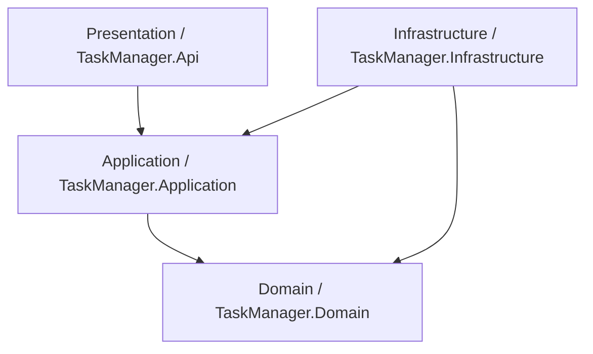

# TaskManager - Project & Task Management API

A production-grade, highly scalable backend system for managing Projects and Tasks, designed using **Clean Architecture** and **Command Query Responsibility Segregation (CQRS)** patterns.

---

## 🏗️ Technical Stack

- **Framework**: .NET 9
- **Database**: SQL Server
- **ORM**: Entity Framework Core
- **Authentication**: JWT Bearer Authentication & ASP.NET Core Identity
- **Design Patterns**: CQRS with MediatR, Repository Pattern & Unit of Work, Result Pattern
- **DevOps**: Docker & Docker Compose

---

## 📂 Architecture Overview

The system is designed following **Clean Architecture** principles to promote high testability, maintainability, and loose coupling:

### 1. Domain Layer (`TaskManager.Domain`)
- Core domain models: `Project` and `ProjectTask`.
- Identity models: `ApplicationUser` and `ApplicationRole`.
- Business constants and enums: `Status` (Todo, InProgress, Completed), `Priority` (Low, Medium, High).
- Zero external dependencies.

### 2. Application Layer (`TaskManager.Application`)
- Business workflows implemented as **CQRS** Commands and Queries using **MediatR**.
- Request/Response contracts (DTOs) and mappings.
- Validation logic implemented via **FluentValidation** and integrated automatically into the MediatR pipeline using custom pipeline behaviors.

### 3. Infrastructure Layer (`TaskManager.Infrastructure`)
- Database context implementation (`ApplicationDbContext`) using Entity Framework Core.
- **Repository Pattern & Unit of Work**: Abstracted database access layer.
- Authentication & JWT Services: Handles JWT generation, Refresh Token validation, and user roles.
- Caching: MemoryCache and Redis integration.
- Database seeding: Automatically seeds default administrative roles and permissions.

### 4. Presentation Layer (`TaskManager.Api`)
- RESTful API Controllers.
- Swagger UI with built-in JWT authorization support.
- Global Exception Handler: Intercepts exceptions globally and returns structured, standardized responses.

- [x] **API Versioning**: URL-based versioning structure prepared (commented hint in Postman collection).

---

## 📋 Implemented Requirements Checklists

### 1. Functional Requirements
- [x] **Authentication**
  - `POST /api/Auth/Register` (Register user)
  - `POST /api/Auth/Login` (Login user and retrieve JWT + Refresh Token)
- [x] **Projects Module** (Ownership-bounded)
  - `POST /api/Projects` (Create project)
  - `GET /api/Projects` (Get all projects created by the authenticated user)
  - `GET /api/Projects/{id}` (Get project by ID - Owner only)
  - `PUT /api/Projects/{id}` (Update project - Owner only)
  - `DELETE /api/Projects/{id}` (Delete project - Owner only)
- [x] **Tasks Module** (Project-scoped & Ownership-bounded)
  - `POST /api/Tasks` (Create task inside a project - Project owner only)
  - `GET /api/Tasks/project/{projectId}` (Get tasks belonging to a project - Project owner only)
  - `PUT /api/Tasks/{id}/status` (Update task status - Project owner only)
  - `DELETE /api/Tasks/{id}` (Delete task - Project owner only)

### 2. Architectural Requirements
- [x] **Clean Architecture**: Strong boundary isolation.
- [x] **Dependency Injection**: Loose coupling via IoC container registration.
- [x] **SOLID Principles**: Single Responsibility (separated handlers and validators), Open-Closed, Dependency Inversion (repositories abstract database logic).
- [x] **DTO Usage**: Request/Response models are decoupled from database entities. Input models are validated prior to execution.
- [x] **Global Exception Handling**: Centralized `GlobalExceptionHandler` returning RFC-compliant `ProblemDetails`.
- [x] **Data Ownership & Security**: Strict ownership checks implemented in the Application Layer; users can only access, update, or delete projects and tasks they created.
- [x] **Validation**: Integrated FluentValidation pipeline.

### 3. Bonus Points Implemented
- [x] **CQRS (Command Query Responsibility Segregation)**: Read and Write pipelines are separated.
- [x] **MediatR**: Decouples Controllers from Business Logic Handlers.
- [x] **Docker**: `Dockerfile` and `docker-compose.yml` included.
- [x] **Generic Response Wrapper**: Monadic `Result` and `Result<T>` pattern for consistent, type-safe operation outcomes.
- [x] **Role-based Authorization**: Restricts endpoints by custom application permissions.
- [x] **Redis Caching**: Built-in caching provider support.

---

## ⚙️ Setup & Execution Guide

The project is designed to be highly flexible and can be executed in two ways:

### 1. Docker Compose (Recommended - Zero Configuration)
This method is ideal for quick evaluation as it sets up the API, SQL Server 2022, and Redis automatically with data persistence.

**Steps:**
1.  **Open the Solution** in Visual Studio.
2.  Locate the **docker-compose** project in the Solution Explorer.
3.  **Right-click** it and select **Set as Startup Project**.
4.  Press **F5**.
5.  **Automatic Migrations**: The API will automatically create the database and tables upon startup.
6.  **Access**: Swagger UI will open at `http://localhost:5000/swagger`.

### 2. Local Execution (Manual Setup)
If you prefer running the project on your local machine without Docker:

**Steps:**
1.  **Database Config**: Update the `DefaultConnection` in [appsettings.Development.json](file:///d:/C__/Hiring-Tasks/TaskManager/TaskManager.Api/appsettings.Development.json) to point to your local SQL Server instance.
2.  **Automatic Migrations**: No need to run CLI commands; the application will execute `context.Database.Migrate()` on startup.
3.  **Redis Fallback**: The system is built with a **Smart Fallback Mechanism**. If a local Redis server is not detected, it will automatically switch to `AddDistributedMemoryCache` (In-Memory). This ensures the application runs perfectly even without Redis installed.
4.  **Run**: Set `TaskManager.Api` as the startup project and press **F5**.

---

## 🔐 Authentication & Testing

1. **Default Credentials**: The system seeds an admin user automatically:
   - **Email**: `admin@taskmanager.com`
   - **Password**: `P@ssword123`
2. **Authorize**:
   - Call `POST /api/Auth/Login` to get the JWT.
   - Use the **Authorize** button in Swagger to paste the token.
3. **Postman**: A pre-configured [TaskManager_Postman_Collection.json](file:///d:/C__/Hiring-Tasks/TaskManager/TaskManager_Postman_Collection.json) is available in the root folder.
   - **Docker Port**: `http://localhost:5000` (Default in Collection).
   - **Local Port**: `http://localhost:5156` (If running without Docker, simply update the `baseUrl` variable in Postman).

---

## 🏗️ Architecture & Pro-Features Implemented

- **Clean Architecture**: Strict separation of concerns across 4 layers.
- **CQRS**: Command Query Responsibility Segregation using **MediatR**.
- **Data Ownership**: Users can only access and manage projects/tasks they created (checked in the Application layer).
- **Resiliency**: Built-in **Retry Policy** for SQL connections to handle transient failures in containerized environments.
- **Validation**: Centralized validation using **FluentValidation** pipeline behaviors.
- **Global Exception Handling**: Returns standardized RFC-compliant `ProblemDetails`.
- **Monadic Result Pattern**: Consistent, type-safe API responses.

